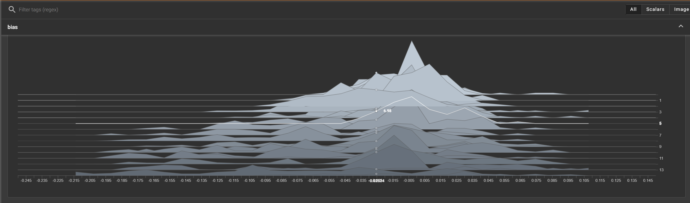

# Qunatization of Neural Networks



## Introduction

> python evaluate-quantized.py

Quantized Model Accuracy: **98.93%**

>python evaluate-non-quantized.py

Original Model Accuracy: **98.94%**

🤯🤯🤯

## Setup

```bash
conda create --name tf_quantization python=3.12

pip install tensorflow tensorboard
```

## Training a model

you may want to play with EPOCHS and BATCH_SIZE in the script

```bash
python train-model.py
```

## Quantizing a model

```bash
python quantize_model.py
python test_quantized_model.py
```

## Tensorboard (Optional)

```bash
tensorboard --logdir logs
```

open <http://localhost:6006/> in your browser

## Evaluate the model

```bash
python evaluate-quantized.py
python evaluate-non-quantized.py
```

## Test inference time

```bash
python test-inference-time.py
```
